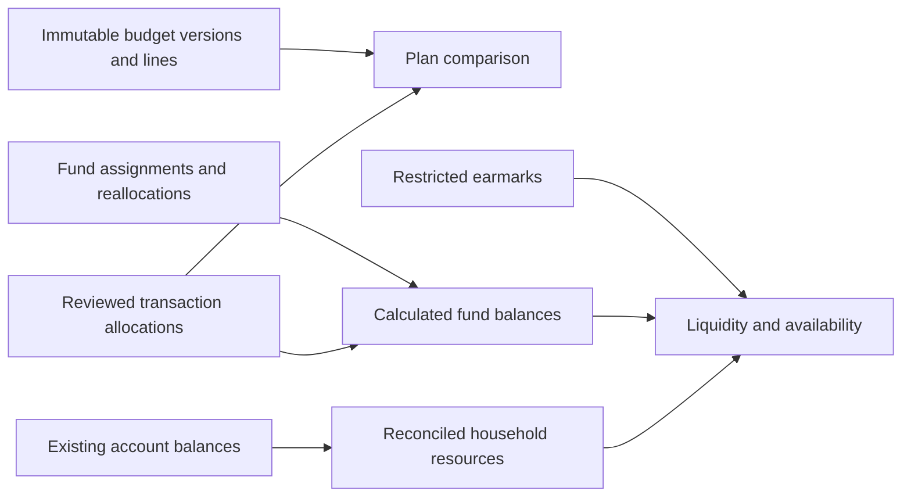

# Budget behaviour

Revised 2026-09-29: one household plan, persistent purpose funds, reviewed spending
allocations and a small ledger of assignments. Account balances answer whether
resources exist; they do not decide whose expense a purchase was.

## Five concepts

| Concept | Question | Example |
| --- | --- | --- |
| Category | What was bought? | Personal care |
| Versioned budget line | What did we agree to provide? | Cara personal care, R300 per cycle |
| Fund | What remains reserved for that purpose? | R900 accumulated |
| Transaction allocation | Who benefited, who paid, which purpose? | Cara personal care paid by Gustav |
| Account | Where is the money or liability? | Bank account, card, notice savings, mortgage |

Fixed/variable describes predictability, not rollover. Keep beneficiary, payer
and category separate. A shared expense remains shared whichever card pays.

## Budget history without multiple historical models

Drafts are editable. Publishing creates a complete immutable snapshot of line
amounts, categories/display names, beneficiaries, planned payers, funding behaviours,
dates and expected net income. A change to the agreement creates a new version.
Spending and transaction corrections do not create budget versions.

Versions start on a cycle: the latest published version applicable to that cycle
supplies its whole-cycle plan. Show the originally applicable version alongside
the current one. Future-cycle versions are allowed. Multiple publications for one
cycle are ordered by publication sequence. Do not silently prorate or sum versions.

Example: change Groceries from R6,000 to R6,500 during a cycle. Publish a full
replacement snapshot for that cycle. Show original 6,000, change 500, current
6,500. Actual spending does not move; funding the extra 500 is a separate explicit
action. Saving a forecast that exceeds expected income is allowed with a visible
gap; assigning nonexistent money is not.

Allocation records point to stable funds and keep their reviewed category and
beneficiary. A new plan/category mapping only changes suggestions for new reviews;
it never recategorises old purchases. A transaction correction explicitly replaces
its allocation set. Old budget snapshots remain unchanged. Historical actuals
show latest reviewed facts and a correction trail; frozen month-end reports and
formal restatement are deferred.

Moving money already saved between purposes records a fund movement. It does not
by itself change the recurring plan. If the user also changes planned amounts,
publish a new version; one combined action can commit both atomically. This keeps
routine funding decisions separate from changes to the agreement.

Funds persist across versions and cycles. Removing a line never deletes its fund,
spending or balance. Keep a retired fund until its remaining money is explicitly
released or reallocated. Do not rewrite category history on a rename/split/merge.

## Cycle and recognition dates

Use the confirmed 23rd inclusive to next 23rd exclusive in Africa/Johannesburg,
labelled with explicit dates. Offer calendar-month reporting as a grouping of
actuals. Store local source incurred dates separately from bank posting dates.
Arbitrary cycle changes and automatic transition-period prorating are deferred.

Use canonical transaction `occurred_on`. ISMRT retains its documented incurred
dates, including the named month for water; do not invent daily water spending.
Opening funds have a reconciled cutoff: pre-cutoff activity appears in reports but
is not subtracted again from the opening fund balance. Late-discovered pre-cutoff
facts require an explicit opening correction, not a second deduction.

## Funding behaviours on a line

| Behaviour | Household uses | Rule |
| --- | --- | --- |
| Cycle allowance | Groceries, fuel, coffee, work eats, bills | Assign for the cycle; explicit release or carryover at the boundary |
| Accumulating contribution | Gifts, clothing, each person's personal care | Assign the contribution; unused money stays |
| Target by date | Annual renewal, trip | Suggest the unfunded target divided by remaining contribution dates |
| Reserve target | Emergency or maintenance buffer | Suggest enough to replenish toward a chosen balance |

Store the behaviour and optional target/date directly on the versioned line.
V1 has one target per line, not separate birthday/renewal sub-reservations in a
fund. An annual gift allowance can be one accumulating fund. Multiple dated
obligations can be added later if the household actually needs them.

One fund has at most one line in a budget version. Distinct targets use distinct
funds, grouped in reporting if useful, so the same saved balance cannot satisfy
two target calculations.

For a target by date, in cents:

`suggestion = ceil(max(0, target - current eligible fund balance) / remaining funding dates)`

Round the final contribution down as necessary so the total is exact. With zero
funding dates left, show the entire shortfall as due now. Example: R6,000 target,
R1,000 saved, five funding dates → R1,000 each. Future contributions are forecasts,
not current funds. For renewal, advance the due date/target in a new version;
leftover money remains until explicitly released.

Required payments, retirement contributions and extra mortgage reduction can
have temporary funds before payment, but money paid out for those purposes does
not remain spendable. Report those effects separately from consumption.

## One calculation of fund balances

`balance = net assigned money + reviewed refunds - reviewed purpose outflows`

The equivalent query is net assigned money plus signed allocation fund deltas:
purpose outflows are negative, refunds positive, income/financing/movements zero.
Fund-affecting components always name a fund; an unattributed purchase remains
unresolved. Normalize provider sign conventions before applying these rules.

Net assigned money comprises opening assignments, later assignments and
reallocations in, less releases and reallocations out. Purpose outflows include
consumption and explicitly classified contribution/debt payments. Source transfers
between included cash accounts have no purpose-outflow effect.

Purchases affect this formula through transaction allocations only. Do not also
write a purchase journal. A refund restores its linked fund; an unlinked incoming
amount waits for review. Correcting an allocation changes the derived balance
once. Movements are append-only: corrections reverse the assignment, not the
purchase. A reallocation contains both endpoints in one record.

Example: Gifts opens at R1,000, receives R500 and spends R1,200 → R300 remains.
That is not overspending merely because purchases exceeded this cycle's R500
contribution. A linked R200 refund restores R500.

Negative funds remain visible. Cover deficits with an explicit reallocation or
assignment; never zero them automatically. At cycle rollover, release only approved
remainders after allowing for pending activity. Accumulating funds need no rollover
write at all: their balances already persist. Annual targets never reset money.

## Household availability and cards

Distinguish three answers: available by purpose, unassigned household resources,
and cash in the account that must make a payment. They are different views of
the same money and must not be added together.

Start from reconciled included cash at a common as-of point, subtract all included
card debt once, and account once for pending outflows not already reflected.
Exclude unused credit, future salary, expected refunds, investments and property
equity. Include overdrawn cash balances as negative. Unknown account coverage,
stale balances or uncertain pending/posted linkage makes the result incomplete.

For liquid availability, restrict purpose claims to their liquid portion:

`liquid purpose claim = fund balance - restricted earmarks`

For posted, fully reviewed activity:

`liquid unassigned = reconciled net liquid resources - sum(liquid purpose claims)`

A known purpose's pending outflow reduces both its displayed purpose availability
and resources once; unknown-purpose exposure reduces unassigned resources. Do not
subtract it twice merely because it appears as both pending and posted or is
already included in the bank's available-balance number. Derive exposure from
source identities/states; there is no writable holds ledger. If identity or balance
convention is ambiguous, show a provisional result requiring reconciliation.

When pending or stale-source deltas exist, use an explicit derived adjustment:
subtract each not-yet-recognised outflow from resources exactly once (or reuse
the deduction already in the observed balance). For a known liquid purpose,
subtract the same amount from its claim before calculating provisional unassigned.
For an unknown purpose, do not reduce a fund claim; the exposure consumes
unassigned money. Example: a known R600 pending grocery purchase against the
R20,000/R3,000/R15,000 example below gives provisional net resources R16,400,
claims R14,400 and unassigned R2,000. An unknown-purpose R600 instead leaves
claims R15,000 and provisional unassigned R1,400. Confirmation replaces these
adjustments with the reviewed allocation, never adds a second deduction. Pending
restricted-fund spending requires a funding-location decision; until then flag
liquid availability uncertain instead of assuming a redraw has occurred.

Signed fund balances preserve the arithmetic; negative funds must be covered
before positive availability is presented as fully funded. Example: net resources
R500, funds +R600 and -R100 means net claims R500 but positive claims are R100
underfunded. Do not call the R600 fully available. Bills reserved inside a fund
are already claims, not a further deduction outside that fund.

Card debt is the liability deduction above. Do not create a second fund/reserve
for the same repayment amount. Example: cleared cash R20,000, card debt R3,000,
fund balances R15,000 → R2,000 unassigned. A funded R600 card purchase lowers
funds to R14,400 and raises card debt to R3,600; unassigned remains R2,000.
Repayment gives cash R19,400/debt R3,000, still R2,000 unassigned. The repayment
has no second fund effect. This requires the balance and purchase observations to
be reconciled to the same cutoff; stale liabilities cannot imply extra resources.

This is availability for named purposes, not a promise that bills, emergency
reserves or personal allowances are all discretionary spending money.

## Payer and beneficiary

Cara buys R600 groceries on her card. Record one shared-groceries allocation,
actual payer Cara, payment account her card. The household Groceries fund falls
R600. Gustav may have been the planned payer; that does not change the expense.

If Gustav later transfers R600 to Cara, the existing financial event records an
internal transfer. Household consumption and the Groceries fund do not change.
Do not invent a receivable between spouses or require a reimbursement link.

Account settings identify owner/shared and can name a card's usual settlement
account. If Gustav's account settles Cara's card, retain Cara as purchaser and
show the actual repayment from Gustav's account. V1 does not claim to allocate a
whole card payment back to every purchase. Settlement support and statement-level
forecasting can be added later; basic attribution does not depend on them.

Display Shared/Gustav/Cara beneficiary totals alongside payer totals. Preserve
current payer assignments; do not impose 50/50 or an income ratio. A future agreed
contribution policy would belong in a budget version.

## Restricted reserves: the one necessary exception

Pool ordinary household cash without assigning every fund to a bank account.
Record only restricted portions as earmarks against a notice account, utility
wallet or verified access-mortgage reserve. Earmarks are contained within fund
balances; they never add money to them. Show total purpose balance and liquid
portion separately. A restriction ending or a mortgage withdrawal moves a claim
to liquid availability, not into income.

Per fund, earmarks cannot exceed its nonnegative balance. Per restricted account,
they cannot exceed verified eligible resources. Unassigned restricted resources
remain restricted; they cannot cover a liquid deficit. New restricted assignments
must create their earmarks atomically, so they never appear briefly as liquid.
A restricted reallocation moves corresponding earmarks along with the fund money.

The spreadsheet's R16,500 mortgage transfer comprises R6,500 extra reduction and
R10,000 reserves: emergency R5,000, car R3,000, home R2,000. First assign those
purposes from existing household resources. Allocate only R6,500 of the transfer
as an extra-debt purpose outflow; the other R10,000 is a movement whose existing
fund balances receive mortgage earmarks. Cash falls R16,500, liquid claims fall
R16,500, and the R10,000 remains visibly restricted. The receiving leg is a mirror,
not another saving contribution. Earmarks do not add to net worth because the
loan balance already reflects the deposit.

To pay a R3,494 service from the car reserve, release that earmark when the
verified redraw reaches cash, then consume the car fund once for the purchase.
If the purchase comes first, consuming the fund also releases that portion of
its earmark: temporarily show a liquid deficit until redraw or other funding
covers it. This does not claim the restricted money has already arrived. The
later withdrawal changes resources without releasing the earmark a second time.
Keep linked source references so these alternatives are distinguishable.

Verify current redraw conditions and eligible reserve amounts. Neither a sheet's
old balance nor available equity proves that savings are accessible. Until
reconciled, show an unverified reserve separately and exclude it from availability.

## Categorisation, splits and special sources

Reuse household categories; avoid names encoding both people and accounts.
The line can suggest a fund from category plus beneficiary. If that combination
is ambiguous, review it. A merchant alone cannot prove groceries versus gifts,
or work eats versus eating out.

Confirmed actuals come from reviewed allocations with confirmed treatment or an
explicitly approved deterministic policy. Source labels can populate a provisional
view but do not become confirmed decisions. Pending/unresolved outflows still
reduce conservative availability. Keep the classifier in shadow mode.

A R900 mixed purchase can have R600 groceries and R300 gifts components. They sum
to the source amount and replace the parent in budget totals. Source amount/date
changes flag the old set for review; an audited replacement updates derived
actuals. Never silently drop already-recognised spending on an archive flag.

| Case | Treatment |
| --- | --- |
| Card purchase and repayment | Purchase uses fund once; repayment settles liability |
| Transfer between included accounts or spouses | Movement, no consumption or income |
| RA/TFSA contribution | Uses contribution fund once; counts toward goal, not consumption |
| Payroll retirement/medical aid | Display context only if already withheld from net salary; no extra cash debit |
| Required mortgage payment | Uses required-payment fund once; principal/interest analysis is separate, never added to payment total |
| Extra mortgage principal | Uses extra-debt fund; reserve portion instead retains fund balance and gets an earmark |
| ISMRT top-up and incurred usage | Top-up moves cash to restricted wallet; canonical charges consume utility fund and reduce wallet earmark once |
| Utility correction | Reviewed reversal/refund restores purpose and appropriate restricted portion |
| Cash withdrawal | Movement to included tracked cash; unresolved use stays visible |
| Giving held in an owned savings account | Still reserved money; actual donation consumes giving fund |
| Asset sale or borrowing | Financing movement, not recurring salary; proceeds require explicit reconciliation before assignment |

Use existing financial events/legs to distinguish economic recognition, mirrors
and settlements. Utility allocation support must link bank top-ups and consumption
facts before combining those sources. This is a scoped source adapter, not a new
canonical transaction ledger. Where evidence is insufficient, expose uncertainty
rather than guessing a transfer pair or inventing a principal/interest split.
